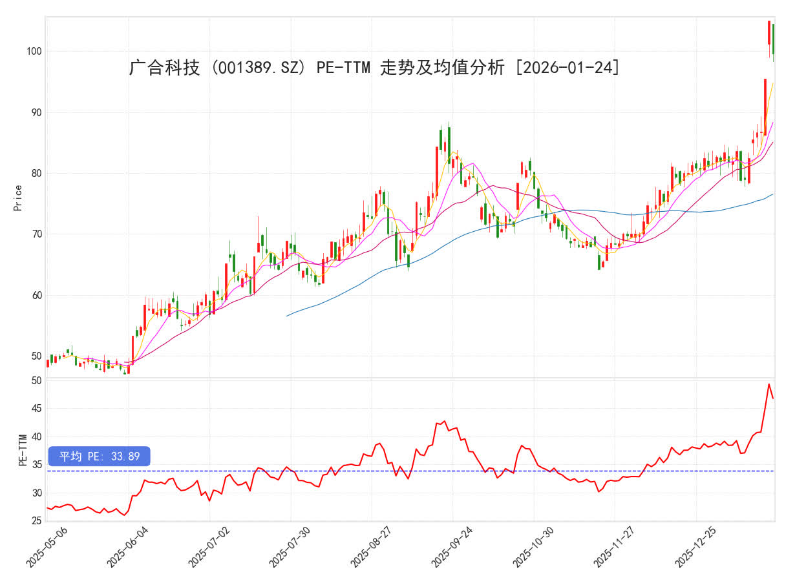

# 股票量化分析 📈

这是个人开发的极简版股票量化分析工具，它既是一个实用的量化工具，也是一个深度教学平台（详情请访问：[stock-analysis](https://artinte.github.io/stock-analysis/)
），旨在帮助投资者建立一个数据驱动的理性交易体系。如下是系统架构图：


该工具专注于核心数据回溯、多指标估值分析及全市场策略筛选。以下是一个简单的完整例子：通过量化绘制广合科技近半年的 K 线图与 PE 走势，我们可以直观地看到估值泡沫。

<p align="center">
  
  <br>
  <b>示例分析：广合科技 (001389) K线走势与 PE-TTM 估值偏差</b>
</p>

PE-TTM 计算规则：当前总市值 $\div$ 最近 4 个季度的净利润总和（即过去 12 个月的滚动利润）。

另一个非常简单的例子，就是可以输入股票历史数据（输入的因素越多，股票预测就会越准确），直接预测未来几天股票的收盘价、开盘价、最高价、最低价，以下是贵州茅台公司为例，输入过去一年的数据，预测未来五天的数据。

```
开始基于 20 年数据训练 (设备: cuda)...
Epoch 200, Avg Loss: 0.237260
Epoch 400, Avg Loss: 0.178400
Epoch 600, Avg Loss: 0.110641
Epoch 800, Avg Loss: 0.085509
Epoch 1000, Avg Loss: 0.065867

600519.SH 未来 5 日预测 (当前: 1337.00)
T+1: 1270.80 (幅度: -4.95%)
T+2: 1281.24 (幅度: -4.17%)
T+3: 1151.77 (幅度: -13.85%)
T+4: 1218.93 (幅度: -8.83%)
T+5: 1245.81 (幅度: -6.82%)
```

本预测结果仅为基于历史 20 年量价数据的深度学习实验，不构成任何投资建议。模型运行处于封闭的数据环境中，未考虑宏观经济、地缘政治、行业政策及突发新闻等外部核心变量。

---

## 🏗 代码结构

本项目采用模块化设计，将数据承载、逻辑筛选与结果展示分离，确保代码的高可维护性：

* **`stock_detail.py` (数据核心)**

    定义 `StockDetail` 类，作为整个库的“数据心脏”。它不仅记录价格、涨跌幅、市值、股本等基础行情，还集成了复杂的财务回溯算法，用于计算：
    * **估值三剑客**：PE (TTM)、静态 PE、动态 PE。
    * **增长引擎**：营业总收入及其同比增速、净利润增长率，行业发展前景。
    * **技术面指标**：MA 均线系统、威廉指标（WR）、乖离率（BIAS）等。

* **`stock_strategy.py` (策略引擎)**

    量化选股逻辑所在地。支持通过 `for` 循环遍历全市场股票池，利用 `StockDetail` 提供的多维度指标进行复合筛选。例如：“营收增长 > 30% 且 PE (TTM) < 40 且当前股价处于 MA20 之上”。

* **`stock_monitor.py` (终端看板)**

    负责将 `StockDetail` 对象的属性进行格式化排版并打印。它将复杂的后台数据转化为直观的、具有金融终端感的命令行看板，方便快速审阅个股体检报告。


* **`stock_predict.py` (股价预测)**

    该模块采用深度学习中的 `Transformer (Attention-based)` 架构。相比传统的 LSTM，它能更好地捕捉股票序列中的“长程依赖”关系和捕捉由于重大新闻、财报引发的非线性突变。


⚠️ 注意： 本系统集成券商私有数据接口，目前仅支持 中国银河证券 - 星耀数智 平台。

---

## 📊 核心展示 (北方华创示例)

通过 `stock_strategy.py` 筛选出符合特定技术指标或财务条件的优质股票：

```text
【量化多因子评价报告 - 利益最大化执行策略】
================================================================================
  代码     名称        行业  得分   市值      营收    现价  PE_TTM   利润增长率  振幅%
000157.SZ 中联重科  工程机械   9   767.13   371.56   8.87   17.83   24.89      4.96
603236.SH 移远通信  通信设备   9   287.10   178.77   99.75   29.75  105.65     3.80
002245.SZ 蔚蓝锂芯    电池     9   226.84   58.14    19.66   31.54   82.05     9.17
601628.SH 中国人寿    保险     9  12925.45  5378.95  45.73    7.59   60.54     3.92
002131.SZ 利欧股份 互联网服务  8   568.83   144.54    8.40  116.29  469.10     16.39
600183.SH 生益科技  电子元件   8   1718.36  206.14   70.74   61.16   78.04     6.48
600105.SH 永鼎股份  通信设备   8   398.39   36.30     27.25  119.56  474.30    3.63
002080.SZ 中材科技  玻璃玻纤   8   665.71   217.01    39.67   37.75  143.24    5.42
002703.SZ 浙江世宝 汽车零部件   8   197.43  24.62     24.00  105.68   33.66    7.33
```

策略也很容易迁移到行业上，通过 `etf_list.py` 可以非常直观地看到整个行业的现状，避免陷入盲人摸象的现状。


通过 `stock_monitor.py` 打印出的标准化股票“体检报告”如下：

```text
========================================
股票名称: 北方华创 (002371.SZ)
更新时间: 2026-01-20 00:00:00
----------------------------------------
现价: 514.2      开盘: 521.0
最高: 531.22     最低: 511.05
涨跌: -9.67      幅度: -1.85%
----------------------------------------
总股本: 7.24 亿股   总市值: 3725.26 亿元
流通股: 7.24 亿股   流通值: 3722.28 亿元
----------------------------------------
营业总收入: 273.01 亿元  (同比: 34.14%)
PE(TTM): 59.23    PE(静态): 66.27    PE(动态): 54.46
----------------------------------------
成交量: 7165317 股   成交额: 37.16 亿元
换手率: 0.99%        量比: 0.66
----------------------------------------
涨停: 576.26      跌停: 471.48
均价: 518.63      振幅: 3.85%
----------------------------------------
移动平均价 (MA): 
MA3: 520.65 | MA5: 512.4 | MA10: 507.36 | MA20: 488.25 | MA30: 476.01 | MA60: 447.17
----------------------------------------
威廉指标(14): 24.52    乖离率(5): 0.35%
========================================
```

---

## 🚀 路线图 (Roadmap)

项目正在持续迭代中，后续主要开发方向包括：

- [ ] AI 趋势预测：引入深度学习模型（如 Transformer）对历史量价和财报信息进行处理，结合热点新闻事件，探索股价未来趋势的概率预测。

- [ ] 数据层抽象接口：重构底层数据模块，实现对不同券商数据源（如通达信、同花顺、各量化开放平台 API）的无缝接入与切换。

- [ ] 动态可视化看板：集成 mplfinance 或 plotly 绘制实时 K 线图，支持在终端或网页端同步查看技术指标叠加效果。

- [ ] 深度基本面画像：细化行业分类系统，增加“核心竞争对手对比”、“主营业务构成分析”等更细颗粒度的公司画像数据。

- [ ] 交易员成长手册：新增股票量化与基础知识教程，涵盖从基础财务指标（PE/PB/ROE）到高级量化策略的应用。

- [ ] 前沿趋势洞察：集成对 AI 泡沫辨析、商业航天等硬科技赛道的宏观逻辑理解。

- [ ] 网络新闻爬虫：构建多源新闻与公告采集系统，自动抓取财经媒体、交易所公告、研报摘要及社交平台热点信息，提供实时舆情与事件驱动信号。

- [ ] 外围联动分析： 利用交易时差，参考美股等外围市场的波动，预判并指导A股走势。

---


## ⚖️ 免责声明

本仓库所有内容及代码仅供技术研究和交流使用，不构成任何投资建议。投资者据此操作，风险自担。金融市场波动剧烈，投资需谨慎。

如果您觉得这个项目有参考价值，欢迎给予一个 Star ⭐ 以示鼓励！
